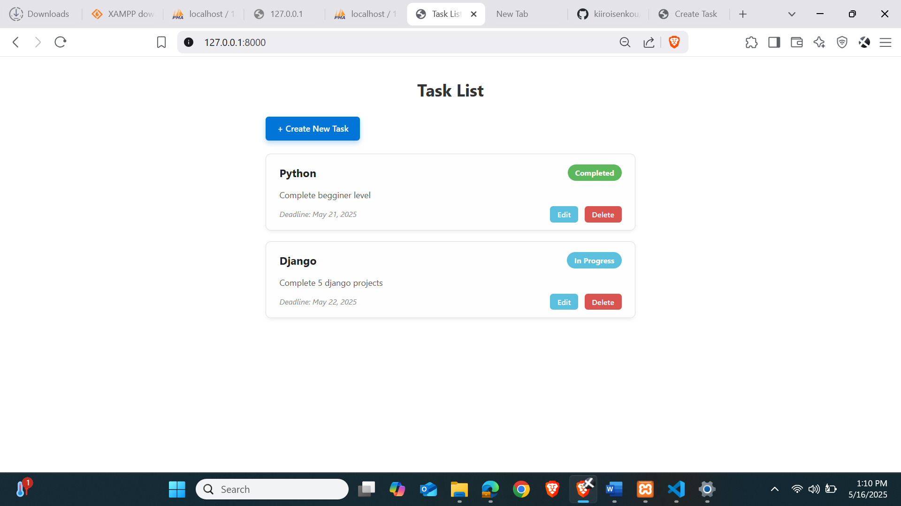
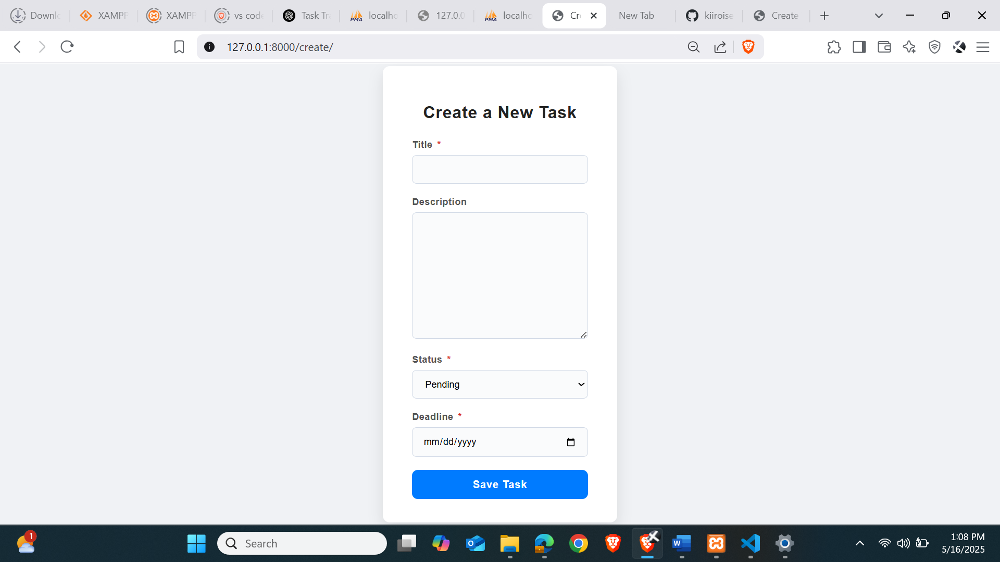

# Django Task Tracker

A simple task management web application built with Django.  
Allows users to create, update, view, and delete tasks with attributes like title, description, status, and deadline.

---

## Features

- Create new tasks with detailed descriptions
- View a list of all tasks with status and deadlines
- Update existing tasks
- Delete tasks
- Responsive and clean UI with CSS styling

---

## Screenshots

### Task List Page

### Task Create/Edit Form

---

## Tech Stack

- Python 3.x
- Django 4.x (or your Django version)
- HTML5, CSS3
- SQLite (default Django database)

---

## Getting Started

### Prerequisites

- Python 3 installed on your machine
- pip package manager

### Installation

1. Clone the repository:

git clone https://github.com/yourusername/django-task-tracker.git

cd django-task-tracker

# Run migrations:
python manage.py migrate

# Start the development server:
python manage.py runserver
# Open your browser and go to:
http://127.0.0.1:8000/

Usage

Navigate to the task list page.

Click Create New Task to add a task.

Use Edit and Delete links beside each task to manage your tasks.

Tasks display with their title, description, status, and deadline.

# Contributing
Contributions are welcome! Feel free to open issues or submit pull requests.
